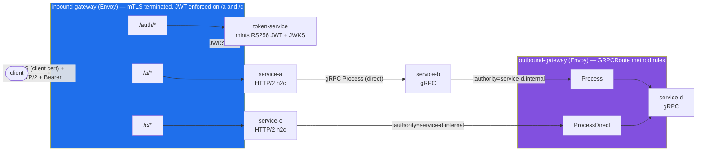
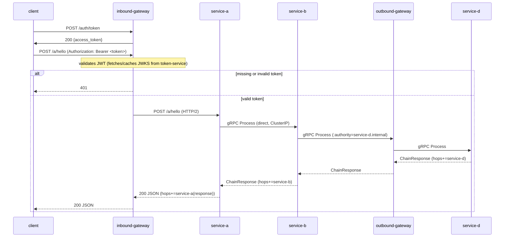
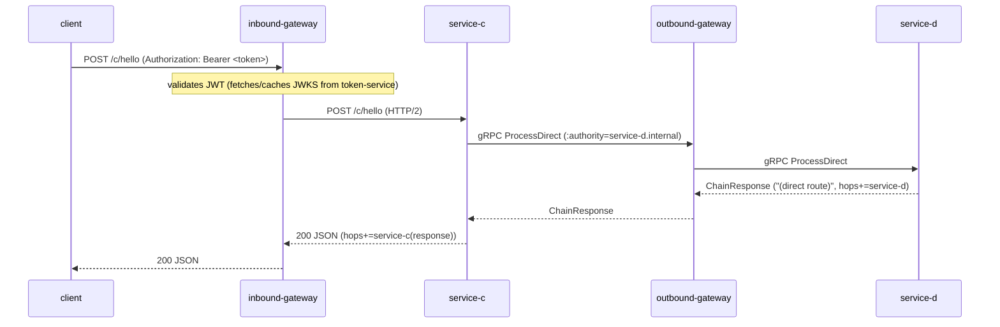

# envoy-experiment

A Go project demonstrating two independent Envoy Gateway instances on a
disposable k3d cluster — **inbound-gateway** (ingress, mTLS-terminating and
JWT-enforcing) and **outbound-gateway** (egress, method-matched) — fronting a
five-service sandbox. The inbound gateway requires a client certificate on
every connection (mutual TLS), then dispatches `/auth` (open, token minting),
`/a` (JWT-protected, gRPC fan-out chain), and `/c` (JWT-protected, short
direct chain); the outbound gateway routes gRPC calls to service-d by
matching on method name (`Process` vs `ProcessDirect`) after clients dial it
with an overridden `:authority`.

## Architecture



<details>
<summary>▶ Watch the traffic flow: animated version of the diagram above</summary>

[](docs/diagrams/architecture/architecture.svg)

*The same topology, animated: a request lights each hop as traffic arrives — the
`/a` fan-out, the `/c` short chain, `/auth` minting, the dashed JWKS fetch, and
the static "locked" mTLS entry. GitHub renders only the first frame inline —
click the image to play it. Details: [`docs/diagrams/architecture`](docs/diagrams/architecture).*

</details>

## Sequence diagrams

Every `client → inbound-gateway` arrow below rides a mutual-TLS connection:
the handshake already verified the client certificate against the demo CA
before the first byte of HTTP reached the gateway.

### Path A — `/a/hello` (gateway → service-a → service-b → egress `Process` → service-d)



<details>
<summary>▶ Watch the traffic flow: animated version of the sequence above</summary>

[](docs/diagrams/path-a/path-a.svg)

*The same exchange as a flow over time: each arrow draws across the gap and the
receiving actor pulses as traffic lands, the response climbs back, the amber JWT
beat marks validation, the **401 short-circuit** draws back when the token is
missing/invalid, and a hops chip accumulates each service. Click to play.
Details: [`docs/diagrams/path-a`](docs/diagrams/path-a).*

</details>

### Path C — `/c/hello` (gateway → service-c → egress `ProcessDirect` → service-d)



<details>
<summary>▶ Watch the traffic flow — animated version of the sequence above</summary>

[](docs/diagrams/path-c/path-c.svg)

*The same exchange as a flow over time: the short `ProcessDirect` chain draws hop
by hop down the lifelines, each actor pulsing as traffic lands, and the response
climbs back — with the amber JWT beat and a hops chip. Click to play.
Details: [`docs/diagrams/path-c`](docs/diagrams/path-c).*

</details>

## Rationale

**Two gateway *instances* under one controller.** Envoy Gateway's controller
is a cluster-wide singleton (installed once via
`make bootstrap-gateway-controller`), but each `Gateway` resource it manages
gets its own Envoy proxy Deployment. Creating `inbound-gateway` and
`outbound-gateway` as separate Helm releases gives us two genuinely
independent proxies — independent listener config, independent policies,
independent lifecycle — while only ever running one controller.

**Egress through a gateway with `:authority` routing.** Rather than having
service-b and service-c dial service-d directly, they dial the
outbound-gateway's stable Service and set the gRPC `:authority` to
`service-d.internal` (via `internal/egress.Dial`). This puts one policy
enforcement point in front of all outbound gRPC traffic, and because the
`GRPCRoute` has per-method rules (`Process`, `ProcessDirect`), each call
path is independently visible and reconfigurable at the routing layer
without touching application code.

**mTLS authenticates the machine; JWT authorizes the request.** The two
layers are deliberately independent. The listener terminates TLS with a
server certificate (`inbound-gateway-tls` Secret) and a
`ClientTrafficPolicy` requires every client to present a certificate signed
by the demo CA (`inbound-gateway-ca` Secret) — connections without one die
at the handshake, before any HTTP routing, JWT check, or service code runs.
The JWT `SecurityPolicy` then decides per route what an authenticated
*connection* may call. That is why `/auth` needs a client cert but no token:
transport identity is cluster-entry policy, tokens are application policy.
All key material is generated locally into the git-ignored `.certs/`
directory by `scripts/gen-certs.sh` and loaded as Secrets by
`make deploy-infra` — nothing is committed.

**JWT lives in a per-route `SecurityPolicy`, not in the services.**
`inbound-gateway`'s `SecurityPolicy` targets only the `HTTPRoute`s marked
`requireJWT: true` (`/a`, `/c`), validating RS256 JWTs against a remote JWKS
(issuer `http://token-service.envoy-experiment.svc.cluster.local:8080`,
audience `envoy-experiment`). This keeps service-a/b/c/d entirely
auth-free — they trust the gateway — while `/auth` stays open so a token can
be minted without one. An invalid or missing token never reaches a
service; the gateway returns `401` at the edge.

**token-service keeps keys in memory.** RSA keys are generated at process
startup and never persisted (see `internal/tokenservice/service.go`), so no
private key material lives in the repo, and restarting the pod rotates the
keypair — a convenient way to demonstrate that previously minted tokens stop
validating once the JWKS changes.

**Stable Service + named `targetPort`.** Envoy Gateway auto-creates
a Service per Gateway whose name includes a non-deterministic hash, so each
chart also defines a stable-named Service (`inbound-gateway` /
`outbound-gateway`, in `envoy-gateway-system`) selecting the same proxy pods
via the `gateway.envoyproxy.io/owning-gateway-name` label. Its `targetPort`
must be the *named* port Envoy Gateway gives the proxy container's listener
— `https-443` for the inbound gateway's HTTPS listener, `http-80` for the
outbound one — not a bare number (the container listens on 10443/10080
internally). This is what service-b/service-c dial and what `kubectl
port-forward` targets.

## Prerequisites

- `docker`, `k3d`, `helm`, `kubectl`, `go`, `buf`, `openssl` on your PATH
  (see [Configuring buf](#configuring-buf) for the proto toolchain).
- Nothing else — this project creates and destroys its own dedicated k3d
  cluster, named `envoy-experiment` (configurable via `CLUSTER=` on any
  `make` target). It never touches any other cluster you may have.

## Full lifecycle (unattended)

```
make up      # create dedicated k3d cluster, install Envoy Gateway controller,
             # generate demo mTLS certs, build/import images, deploy everything
make demo    # six-step mTLS + JWT walkthrough / E2E acceptance script
make down    # delete the dedicated k3d cluster (removes everything)
```

`make up` disables k3d's built-in Traefik at cluster-creation time so it
never installs its own (conflicting) Gateway API CRDs — Envoy Gateway's Helm
chart brings its own compatible set.

## Granular targets

Individual steps, useful once the cluster already exists:

- `make cluster-up` / `make cluster-down` — just the k3d cluster.
- `make bootstrap-gateway-controller` — install/upgrade Envoy Gateway + GatewayClass.
- `make proto`, `make build`, `make docker-build`, `make k3d-import`
- `make deploy-services`, `make deploy-infra`, `make deploy` (build+import+apply, cluster must already exist)
- `make certs` — generate the demo mTLS PKI (CA + server + client certs) into `.certs/` (idempotent; delete the dir to rotate).
- `make token` — mint a JWT via the open `/auth` route (client cert required), printed as `export TOKEN=...`.
- `make demo` — run `scripts/demo.sh`, the six-step mTLS + JWT walkthrough / E2E acceptance test.
- `make test` — quick single-shot exercise of the full path-A chain through the inbound gateway.
- `make clean` — remove this project's k8s resources, keep the cluster and gateway controller running.
- `make status` — quick health check (pods, gateways, routes).

## Demo walkthrough

`make demo` runs `scripts/demo.sh`, which port-forwards `svc/inbound-gateway`
(in `envoy-gateway-system`) to local port `8888` and drives every request
through the mTLS listener. The samples below assume the flags are collected
once:

```bash
TLS=(--cacert .certs/ca.crt --cert .certs/client.crt --key .certs/client.key \
     --resolve inbound.local:8888:127.0.0.1)
```

`--resolve` pins `inbound.local` to the port-forward so TLS SNI matches the
server certificate's SAN; the URL's hostname doubles as the `Host` header,
and HTTP/2 is negotiated via ALPN. The script exercises six steps:

**0. No client certificate → handshake rejected**
```bash
curl -sS --cacert .certs/ca.crt --resolve inbound.local:8888:127.0.0.1 \
  -X POST https://inbound.local:8888/auth/token
```
Exercises: the `ClientTrafficPolicy`'s client-certificate validation. The
request never reaches routing — curl exits non-zero with a TLS alert.

**1. Mint a token (open `/auth` route, mTLS still required)**
```bash
curl -s "${TLS[@]}" -X POST https://inbound.local:8888/auth/token
```
Exercises: `client → inbound-gateway → /auth (no JWT required) → token-service`.
Expected: JSON containing `"token_type":"Bearer"` and an `access_token`.

**2. No token → 401**
```bash
curl -s -o /dev/null -w '%{http_code}' \
  "${TLS[@]}" https://inbound.local:8888/a/hello
```
Exercises: `client → inbound-gateway` JWT check on `/a`, short-circuited
before reaching service-a. Expected: `401`.

**3. Path A full cycle**
```bash
curl -s "${TLS[@]}" \
  -H "Authorization: Bearer $TOKEN" \
  -X POST https://inbound.local:8888/a/hello -d 'ping-a'
```
Exercises: `client → inbound-gateway (JWT OK) → service-a → service-b (gRPC
Process, direct) → outbound-gateway (GRPCRoute Process rule) → service-d`.
Expected: JSON containing
`"hops":["service-a","service-b","service-d","service-a(response)"]`.

**4. Path C short cycle**
```bash
curl -s "${TLS[@]}" \
  -H "Authorization: Bearer $TOKEN" \
  -X POST https://inbound.local:8888/c/hello -d 'ping-c'
```
Exercises: `client → inbound-gateway (JWT OK) → service-c → outbound-gateway
(GRPCRoute ProcessDirect rule) → service-d`. Expected: JSON containing
`"hops":["service-c","service-d","service-c(response)"]` and the message
substring `(direct route)`.

**5. Tampered token → 401**
```bash
curl -s -o /dev/null -w '%{http_code}' \
  "${TLS[@]}" -H "Authorization: Bearer ${TOKEN}tampered" \
  https://inbound.local:8888/a/hello
```
Exercises: `client → inbound-gateway` signature verification against the
JWKS fetched from token-service, rejecting a token whose signature no longer
matches. Expected: `401`.

## Failure modes

- **Client cert signed by a different CA (or none).** The TLS handshake
  fails before any HTTP exchange — curl reports a TLS alert rather than an
  HTTP status. If `make demo` fails at step 0's inverse (real requests
  rejected), the Secrets in the cluster and the files in `.certs/` have
  likely diverged: rerun `make deploy-infra` (or `rm -rf .certs && make
  deploy-infra` to rotate everything).
- **JWKS fetch lag at first request.** The gateway fetches and caches the
  JWKS from token-service lazily; the very first JWT-protected request after
  a fresh deploy may be slower (or transiently fail) while that fetch
  completes. `scripts/demo.sh` sleeps after starting the port-forward to
  give the stack time to settle, but a cold cluster can still need a retry.
- **Key rotation on token-service restart.** Keys are generated in memory
  at startup and never persisted (see Rationale), so restarting the
  token-service pod invalidates every previously minted token — the gateway
  will start rejecting them with `401` until a fresh token is minted against
  the new JWKS.
- **No refresh tokens or scopes, by design.** `/auth/token` mints a single
  short-lived access token with a fixed audience/issuer; there is no refresh
  flow, no per-route scopes, and no revocation beyond restarting
  token-service. This sandbox demonstrates gateway-enforced JWT validation,
  not a full auth system.

## Repo layout

```
proto/chain/v1/chain.proto        Proto contract (source of truth: Process, ProcessDirect)
gen/chain/v1/                     buf-generated Go code
cmd/{service-a,service-b,service-c,service-d,token-service}/main.go   Entrypoints
internal/servicea/                HTTP/2 handler -> gRPC call to service-b
internal/serviceb/                gRPC server -> egresses to service-d via outbound gateway
internal/servicec/                HTTP/2 handler -> egresses directly to service-d (ProcessDirect)
internal/serviced/                Terminal gRPC server (Process + ProcessDirect)
internal/tokenservice/            RS256 JWT minting + JWKS endpoint, in-memory keys
internal/egress/                  Shared gRPC dial helper (:authority override) for gateway egress
internal/envutil/                 Tiny env-var helper
deploy/k8s/                       Namespace + Deployments/Services for the five Go services
deploy/charts/inbound-gateway/    Helm chart: Gateway (HTTPS + mTLS) + HTTPRoutes (/auth, /a, /c) + JWT SecurityPolicy + ClientTrafficPolicy
deploy/charts/outbound-gateway/   Helm chart: Gateway + GRPCRoute (Process, ProcessDirect method rules)
scripts/gen-certs.sh              Generates the demo mTLS PKI into .certs/ (git-ignored)
scripts/demo.sh                   Six-step mTLS + JWT demo / E2E acceptance script (used by `make demo`)
docs/superpowers/                 Design spec and plan for the JWT multi-route feature
Dockerfile                        Multi-stage build, select service via --build-arg SERVICE=
Makefile                          proto/build/docker-build/k3d-import/deploy/token/demo/test/clean targets
```

Each gateway instance is its own Helm release. Both share the same
Envoy Gateway controller and `envoy` `GatewayClass`, installed once per
cluster by `make bootstrap-gateway-controller` (run automatically as part of
`make up`).

## Configuring buf

All gRPC/protobuf code in `gen/` is generated by [buf](https://buf.build) —
never edited by hand. Two files drive it:

- **`buf.yaml`** — declares the module: `proto/` is the root of the proto
  tree, with lint and breaking-change rules. It is what lets you run
  `buf lint` / `buf breaking` against `proto/chain/v1/chain.proto`.
- **`buf.gen.yaml`** — declares *what to generate*: it invokes the local
  plugins `protoc-gen-go` (messages) and `protoc-gen-go-grpc` (client/server
  stubs), writing into `gen/` with `paths=source_relative` so import paths
  mirror the proto tree (`gen/chain/v1`).

### One-time toolchain setup

```bash
# buf itself (macOS)
brew install buf

# the two code-generation plugins, installed into $GOPATH/bin
go install google.golang.org/protobuf/cmd/protoc-gen-go@latest
go install google.golang.org/grpc/cmd/protoc-gen-go-grpc@latest
```

The plugins do NOT need to be on your everyday PATH: the Makefile's `proto`
target prepends `$GOPATH/bin` for the invocation —

```make
proto:
	PATH="$$PATH:$(GOBIN)" buf generate
```

### Day-to-day workflow

Edit `proto/chain/v1/chain.proto`, then:

```bash
make proto     # regenerate gen/chain/v1/*.pb.go
go build ./... # confirm services still compile against the new contract
```

Adding a new RPC is a three-step change: declare it in the `.proto`, run
`make proto`, implement the new method on the server that owns it (see
`ProcessDirect` in `internal/serviced/server.go` for a worked example —
including how the egress `GRPCRoute` gets a matching per-method rule).

## Cleanup

```
make down
```
Deletes the dedicated `envoy-experiment` k3d cluster and everything in it —
the fastest, most complete teardown. Use `make clean` instead if you want to
keep the cluster and Envoy Gateway controller running between iterations.
