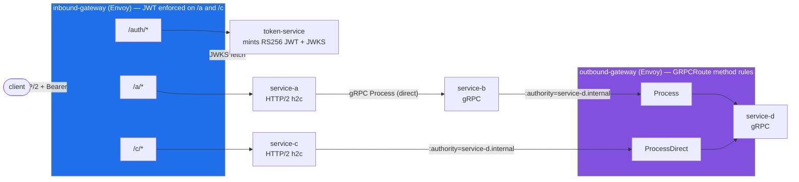
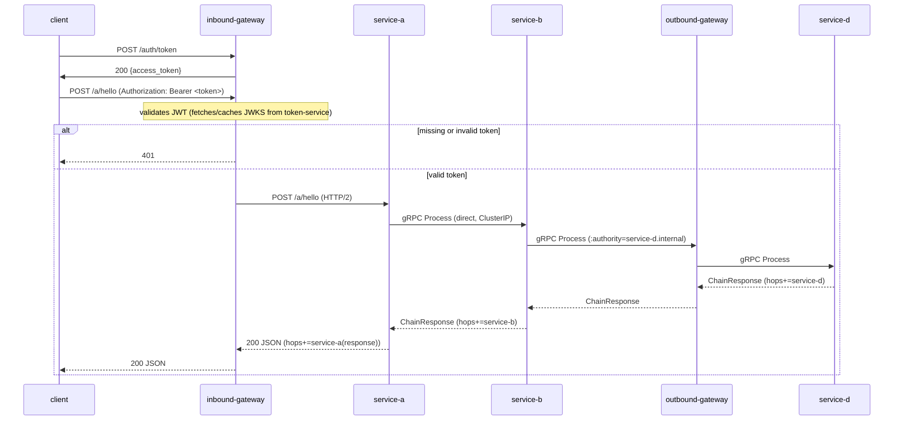
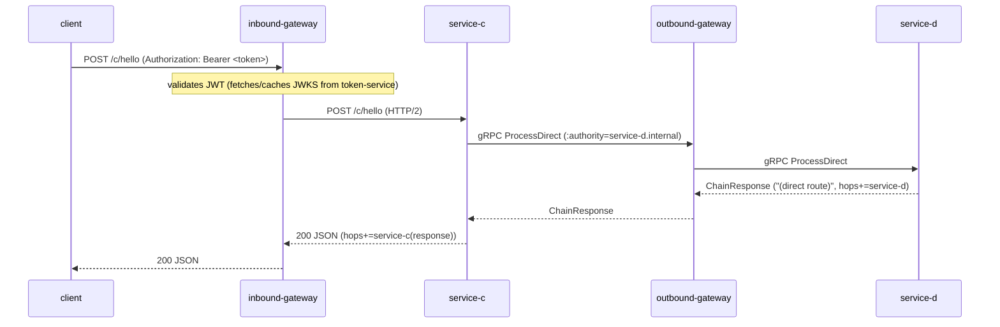

# envoy-experiment

A Go project demonstrating two independent Envoy Gateway instances on a
disposable k3d cluster — **inbound-gateway** (ingress, JWT-enforcing) and
**outbound-gateway** (egress, method-matched) — fronting a five-service
sandbox. The inbound gateway dispatches `/auth` (open, token minting), `/a`
(JWT-protected, gRPC fan-out chain), and `/c` (JWT-protected, short direct
chain); the outbound gateway routes gRPC calls to service-d by matching on
method name (`Process` vs `ProcessDirect`) after clients dial it with an
overridden `:authority`.

## Architecture



## Sequence diagrams

### Path A — `/a/hello` (gateway → service-a → service-b → egress `Process` → service-d)



### Path C — `/c/hello` (gateway → service-c → egress `ProcessDirect` → service-d)



## Rationale

**Two gateway *instances* under one controller.** Envoy Gateway's controller
is a cluster-wide singleton (installed once via
`make bootstrap-gateway-controller`), but each `Gateway` resource it manages
gets its own Envoy proxy Deployment. Creating `inbound-gateway` and
`outbound-gateway` as separate Helm releases gives us two genuinely
independent proxies — independent listener config, independent policies,
independent lifecycle — while only ever running one controller.

**Egress through a gateway with `:authority` routing.** Rather than having
service-b and service-c dial service-d directly, they dial the
outbound-gateway's stable Service and set the gRPC `:authority` to
`service-d.internal` (via `internal/egress.Dial`). This puts one policy
enforcement point in front of all outbound gRPC traffic, and because the
`GRPCRoute` has per-method rules (`Process`, `ProcessDirect`), each call
path is independently visible and reconfigurable at the routing layer
without touching application code.

**JWT lives in a per-route `SecurityPolicy`, not in the services.**
`inbound-gateway`'s `SecurityPolicy` targets only the `HTTPRoute`s marked
`requireJWT: true` (`/a`, `/c`), validating RS256 JWTs against a remote JWKS
(issuer `http://token-service.envoy-experiment.svc.cluster.local:8080`,
audience `envoy-experiment`). This keeps service-a/b/c/d entirely
auth-free — they trust the gateway — while `/auth` stays open so a token can
be minted without one. An invalid or missing token never reaches a
service; the gateway returns `401` at the edge.

**token-service keeps keys in memory.** RSA keys are generated at process
startup and never persisted (see `internal/tokenservice/service.go`), so no
private key material lives in the repo, and restarting the pod rotates the
keypair — a convenient way to demonstrate that previously minted tokens stop
validating once the JWKS changes.

**Stable Service + named `targetPort http-80`.** Envoy Gateway auto-creates
a Service per Gateway whose name includes a non-deterministic hash, so each
chart also defines a stable-named Service (`inbound-gateway` /
`outbound-gateway`, in `envoy-gateway-system`) selecting the same proxy pods
via the `gateway.envoyproxy.io/owning-gateway-name` label. Its `targetPort`
must be the named port `http-80` (not a bare number), because that's the
name Envoy Gateway gives the proxy container's listener port (`10080`
internally) — this is what service-b/service-c dial and what `kubectl
port-forward` targets.

## Prerequisites

- `docker`, `k3d`, `helm`, `kubectl`, `go`, `buf` on your PATH.
- Nothing else — this project creates and destroys its own dedicated k3d
  cluster, named `envoy-experiment` (configurable via `CLUSTER=` on any
  `make` target). It never touches any other cluster you may have.

## Full lifecycle (unattended)

```
make up      # create dedicated k3d cluster, install Envoy Gateway controller,
             # build/import images, deploy services + both gateway instances
make demo    # five-step JWT walkthrough / E2E acceptance script
make down    # delete the dedicated k3d cluster (removes everything)
```

`make up` disables k3d's built-in Traefik at cluster-creation time so it
never installs its own (conflicting) Gateway API CRDs — Envoy Gateway's Helm
chart brings its own compatible set.

## Granular targets

Individual steps, useful once the cluster already exists:

- `make cluster-up` / `make cluster-down` — just the k3d cluster.
- `make bootstrap-gateway-controller` — install/upgrade Envoy Gateway + GatewayClass.
- `make proto`, `make build`, `make docker-build`, `make k3d-import`
- `make deploy-services`, `make deploy-infra`, `make deploy` (build+import+apply, cluster must already exist)
- `make token` — mint a JWT via the open `/auth` route, printed as `export TOKEN=...`.
- `make demo` — run `scripts/demo.sh`, the five-step JWT walkthrough / E2E acceptance test.
- `make test` — quick single-shot exercise of the full path-A chain through the inbound gateway.
- `make clean` — remove this project's k8s resources, keep the cluster and gateway controller running.
- `make status` — quick health check (pods, gateways, routes).

## Demo walkthrough

`make demo` runs `scripts/demo.sh`, which port-forwards `svc/inbound-gateway`
(in `envoy-gateway-system`) to `localhost:8888` and sends `Host:
inbound.local` on every request. It exercises five steps:

**1. Mint a token (open `/auth` route)**
```bash
curl -s -X POST -H "Host: inbound.local" http://localhost:8888/auth/token
```
Exercises: `client → inbound-gateway → /auth (no JWT required) → token-service`.
Expected: JSON containing `"token_type":"Bearer"` and an `access_token`.

**2. No token → 401**
```bash
curl -s -o /dev/null -w '%{http_code}' --http2-prior-knowledge \
  -H "Host: inbound.local" http://localhost:8888/a/hello
```
Exercises: `client → inbound-gateway` JWT check on `/a`, short-circuited
before reaching service-a. Expected: `401`.

**3. Path A full cycle**
```bash
curl -s --http2-prior-knowledge -H "Host: inbound.local" \
  -H "Authorization: Bearer $TOKEN" \
  -X POST http://localhost:8888/a/hello -d 'ping-a'
```
Exercises: `client → inbound-gateway (JWT OK) → service-a → service-b (gRPC
Process, direct) → outbound-gateway (GRPCRoute Process rule) → service-d`.
Expected: JSON containing
`"hops":["service-a","service-b","service-d","service-a(response)"]`.

**4. Path C short cycle**
```bash
curl -s --http2-prior-knowledge -H "Host: inbound.local" \
  -H "Authorization: Bearer $TOKEN" \
  -X POST http://localhost:8888/c/hello -d 'ping-c'
```
Exercises: `client → inbound-gateway (JWT OK) → service-c → outbound-gateway
(GRPCRoute ProcessDirect rule) → service-d`. Expected: JSON containing
`"hops":["service-c","service-d","service-c(response)"]` and the message
substring `(direct route)`.

**5. Tampered token → 401**
```bash
curl -s -o /dev/null -w '%{http_code}' --http2-prior-knowledge \
  -H "Host: inbound.local" -H "Authorization: Bearer ${TOKEN}tampered" \
  http://localhost:8888/a/hello
```
Exercises: `client → inbound-gateway` signature verification against the
JWKS fetched from token-service, rejecting a token whose signature no longer
matches. Expected: `401`.

## Failure modes

- **JWKS fetch lag at first request.** The gateway fetches and caches the
  JWKS from token-service lazily; the very first JWT-protected request after
  a fresh deploy may be slower (or transiently fail) while that fetch
  completes. `scripts/demo.sh` sleeps after starting the port-forward to
  give the stack time to settle, but a cold cluster can still need a retry.
- **Key rotation on token-service restart.** Keys are generated in memory
  at startup and never persisted (see Rationale), so restarting the
  token-service pod invalidates every previously minted token — the gateway
  will start rejecting them with `401` until a fresh token is minted against
  the new JWKS.
- **No refresh tokens or scopes, by design.** `/auth/token` mints a single
  short-lived access token with a fixed audience/issuer; there is no refresh
  flow, no per-route scopes, and no revocation beyond restarting
  token-service. This sandbox demonstrates gateway-enforced JWT validation,
  not a full auth system.

## Repo layout

```
proto/chain/v1/chain.proto        Proto contract (source of truth: Process, ProcessDirect)
gen/chain/v1/                     buf-generated Go code
cmd/{service-a,service-b,service-c,service-d,token-service}/main.go   Entrypoints
internal/servicea/                HTTP/2 handler -> gRPC call to service-b
internal/serviceb/                gRPC server -> egresses to service-d via outbound gateway
internal/servicec/                HTTP/2 handler -> egresses directly to service-d (ProcessDirect)
internal/serviced/                Terminal gRPC server (Process + ProcessDirect)
internal/tokenservice/            RS256 JWT minting + JWKS endpoint, in-memory keys
internal/egress/                  Shared gRPC dial helper (:authority override) for gateway egress
internal/envutil/                 Tiny env-var helper
deploy/k8s/                       Namespace + Deployments/Services for the five Go services
deploy/charts/inbound-gateway/    Helm chart: Gateway + HTTPRoutes (/auth, /a, /c) + JWT SecurityPolicy
deploy/charts/outbound-gateway/   Helm chart: Gateway + GRPCRoute (Process, ProcessDirect method rules)
scripts/demo.sh                   Five-step JWT demo / E2E acceptance script (used by `make demo`)
docs/superpowers/                 Design spec and plan for the JWT multi-route feature
Dockerfile                        Multi-stage build, select service via --build-arg SERVICE=
Makefile                          proto/build/docker-build/k3d-import/deploy/token/demo/test/clean targets
```

Each gateway instance is its own Helm release. Both share the same
Envoy Gateway controller and `envoy` `GatewayClass`, installed once per
cluster by `make bootstrap-gateway-controller` (run automatically as part of
`make up`).

## Regenerating proto code

Edit `proto/chain/v1/chain.proto`, then:
```
make proto
```
(requires `protoc-gen-go` and `protoc-gen-go-grpc` on `$GOPATH/bin`, invoked
by `buf` per `buf.gen.yaml`).

## Cleanup

```
make down
```
Deletes the dedicated `envoy-experiment` k3d cluster and everything in it —
the fastest, most complete teardown. Use `make clean` instead if you want to
keep the cluster and Envoy Gateway controller running between iterations.
