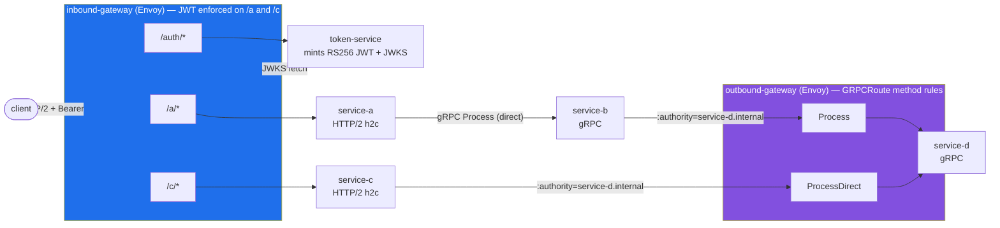

# JWT-Protected Multi-Route Sandbox Implementation Plan

> **For agentic workers:** REQUIRED SUB-SKILL: Use superpowers:subagent-driven-development (recommended) or superpowers:executing-plans to implement this plan task-by-task. Steps use checkbox (`- [ ]`) syntax for tracking.

**Goal:** Extend the envoy-experiment sandbox with a path-routed service-c, gateway-level JWT validation backed by an in-cluster token-service, method-matched egress routes, and demo-grade docs/scripts.

**Architecture:** The inbound Envoy Gateway grows from one HTTPRoute to three (`/auth` open, `/a` and `/c` JWT-protected via a SecurityPolicy with remote JWKS). A new Go token-service mints RS256 JWTs and serves its JWKS. A new Go service-c takes the short path to service-d through the outbound gateway using a new `ProcessDirect` gRPC method, which the egress GRPCRoute matches as a separate rule.

**Tech Stack:** Go 1.27, gRPC + protobuf via buf, `github.com/golang-jwt/jwt/v5`, Helm charts on Envoy Gateway v1.2.5 (Gateway API), k3d, GNU make, bash + curl for demos.

**Spec:** `docs/superpowers/specs/2026-09-09-jwt-multiroute-design.md`

## Global Constraints

- Go module name: `envoy-experiment`; Go `1.27.0` (see `go.mod`).
- Proto codegen ONLY via `make proto` (buf + protoc-gen-go/protoc-gen-go-grpc from `$GOPATH/bin`); never edit `gen/` by hand.
- Envoy Gateway Helm chart pinned to `v1.2.5`; `SecurityPolicy` is apiVersion `gateway.envoyproxy.io/v1alpha1`.
- Dedicated k3d cluster `envoy-experiment`; every kubectl/helm call in Makefile/scripts pinned to context `k3d-envoy-experiment`.
- JWT: RS256 only; issuer `http://token-service.envoy-experiment.svc.cluster.local:8080`; audience `envoy-experiment`; TTL 3600s; NO key material committed to the repo.
- All demo/user traffic enters via hostname `inbound.local` through a port-forward to `svc/inbound-gateway` in `envoy-gateway-system` on local port 8888.
- Every service image is `envoy-experiment/<name>:dev`, built from the single parameterized `Dockerfile` with `--build-arg SERVICE=<name>`.
- Working dir for all commands: `/Users/luispessoa/development/envoy-experiment`.
- Commit messages end with trailer: `Co-authored-by: Copilot <223556219+Copilot@users.noreply.github.com>`.

## File Structure

```
proto/chain/v1/chain.proto            MODIFY  add ProcessDirect RPC
gen/chain/v1/*                        REGEN   via make proto
internal/serviced/server.go           MODIFY  implement ProcessDirect
internal/serviced/server_test.go      CREATE  tests for Process + ProcessDirect
internal/egress/egress.go             CREATE  shared dialer for outbound-gateway (authority override)
internal/serviceb/server.go           MODIFY  use internal/egress
internal/tokenservice/service.go      CREATE  keypair, mint, JWKS
internal/tokenservice/service_test.go CREATE  claim/JWKS round-trip tests
cmd/token-service/main.go             CREATE  HTTP server /auth/token /auth/jwks.json
internal/servicec/server.go           CREATE  h2c handler -> ProcessDirect via egress
internal/servicec/server_test.go      CREATE  handler test against fake gRPC ChainService
cmd/service-c/main.go                 CREATE  h2c entrypoint
deploy/k8s/service-c.yaml             CREATE  Deployment+Service
deploy/k8s/token-service.yaml         CREATE  Deployment+Service
deploy/charts/inbound-gateway/values.yaml               MODIFY routes list + jwt block
deploy/charts/inbound-gateway/templates/httproute.yaml  MODIFY range over routes
deploy/charts/inbound-gateway/templates/securitypolicy.yaml CREATE JWT SecurityPolicy
deploy/charts/outbound-gateway/values.yaml              MODIFY grpcMethods list
deploy/charts/outbound-gateway/templates/grpcroute.yaml MODIFY method-match rules
scripts/demo.sh                       CREATE  5-step E2E demo/acceptance script
Makefile                              MODIFY  SERVICES, token, demo targets
README.md                             MODIFY  mermaid diagrams, rationale, walkthrough
```

---

### Task 1: Baseline commit and jwt dependency

**Files:**
- Modify: `go.mod`, `go.sum` (add `github.com/golang-jwt/jwt/v5`)

**Interfaces:**
- Consumes: existing untracked project tree (never yet committed).
- Produces: a clean git baseline all later tasks commit on top of; `github.com/golang-jwt/jwt/v5` importable.

- [ ] **Step 1: Baseline-commit the existing project**

```bash
cd /Users/luispessoa/development/envoy-experiment
git add -A
git commit -m "chore: baseline two-gateway envoy sandbox

Co-authored-by: Copilot <223556219+Copilot@users.noreply.github.com>"
```

- [ ] **Step 2: Add the JWT dependency**

```bash
go get github.com/golang-jwt/jwt/v5@latest && go mod tidy && go build ./...
```
Expected: exit 0.

- [ ] **Step 3: Commit**

```bash
git add go.mod go.sum
git commit -m "chore: add golang-jwt/jwt/v5 dependency

Co-authored-by: Copilot <223556219+Copilot@users.noreply.github.com>"
```

---

### Task 2: ProcessDirect RPC in proto and service-d

**Files:**
- Modify: `proto/chain/v1/chain.proto`
- Regen: `gen/chain/v1/` via `make proto`
- Modify: `internal/serviced/server.go`
- Test: `internal/serviced/server_test.go`

**Interfaces:**
- Consumes: existing `chainv1.ChainRequest/ChainResponse`, `internal/serviced.Server` with `Process`.
- Produces: `chainv1.ChainServiceClient.ProcessDirect(ctx, *ChainRequest) (*ChainResponse, error)`; serviced `ProcessDirect` message format `"hello from service-d (direct route), payload=<payload>"`, hops = req.hops + `"service-d"`.

- [ ] **Step 1: Add the RPC to the proto**

In `proto/chain/v1/chain.proto`, replace the service block with:

```proto
service ChainService {
  rpc Process(ChainRequest) returns (ChainResponse);
  // ProcessDirect is the "extra route" on service-d, used by service-c via
  // the outbound gateway. Same messages, distinguishable response text.
  rpc ProcessDirect(ChainRequest) returns (ChainResponse);
}
```

- [ ] **Step 2: Regenerate and confirm compile breaks nothing yet**

```bash
make proto && go build ./...
```
Expected: exit 0 (serviced embeds `UnimplementedChainServiceServer`, so it still compiles).

- [ ] **Step 3: Write the failing test**

Create `internal/serviced/server_test.go`:

```go
package serviced

import (
	"context"
	"strings"
	"testing"

	chainv1 "envoy-experiment/gen/chain/v1"
)

func TestProcessAppendsHop(t *testing.T) {
	s := New()
	resp, err := s.Process(context.Background(), &chainv1.ChainRequest{
		TraceId: "t1", Payload: "p", Hops: []string{"service-b"},
	})
	if err != nil {
		t.Fatalf("Process: %v", err)
	}
	if got, want := strings.Join(resp.GetHops(), ","), "service-b,service-d"; got != want {
		t.Errorf("hops = %q, want %q", got, want)
	}
	if strings.Contains(resp.GetMessage(), "direct route") {
		t.Errorf("Process message must not mention direct route: %q", resp.GetMessage())
	}
}

func TestProcessDirectAppendsHopAndMarksRoute(t *testing.T) {
	s := New()
	resp, err := s.ProcessDirect(context.Background(), &chainv1.ChainRequest{
		TraceId: "t2", Payload: "p", Hops: []string{"service-c"},
	})
	if err != nil {
		t.Fatalf("ProcessDirect: %v", err)
	}
	if got, want := strings.Join(resp.GetHops(), ","), "service-c,service-d"; got != want {
		t.Errorf("hops = %q, want %q", got, want)
	}
	if !strings.Contains(resp.GetMessage(), "direct route") {
		t.Errorf("ProcessDirect message must mention direct route: %q", resp.GetMessage())
	}
}
```

- [ ] **Step 4: Run tests, verify the second fails**

```bash
go test ./internal/serviced/
```
Expected: FAIL — `ProcessDirect` hits the Unimplemented stub (returns error).

- [ ] **Step 5: Implement ProcessDirect**

Append to `internal/serviced/server.go`:

```go
func (s *Server) ProcessDirect(ctx context.Context, req *chainv1.ChainRequest) (*chainv1.ChainResponse, error) {
	log.Printf("[%s] (direct route) trace=%s payload=%q hops=%v", hopName, req.GetTraceId(), req.GetPayload(), req.GetHops())

	hops := append(append([]string{}, req.GetHops()...), hopName)
	return &chainv1.ChainResponse{
		Message: "hello from " + hopName + " (direct route), payload=" + req.GetPayload(),
		Hops:    hops,
	}, nil
}
```

- [ ] **Step 6: Run tests, verify pass**

```bash
go test ./internal/serviced/ && go build ./...
```
Expected: PASS, exit 0.

- [ ] **Step 7: Commit**

```bash
git add proto/ gen/ internal/serviced/
git commit -m "feat: add ProcessDirect RPC implemented by service-d

Co-authored-by: Copilot <223556219+Copilot@users.noreply.github.com>"
```

---

### Task 3: Shared egress dialer, refactor service-b

**Files:**
- Create: `internal/egress/egress.go`
- Modify: `internal/serviceb/server.go`

**Interfaces:**
- Consumes: `google.golang.org/grpc`.
- Produces: `egress.Dial(addr, authority string) (*grpc.ClientConn, error)` — plaintext conn to the outbound gateway with `:authority` overridden. Used by serviceb (this task) and servicec (Task 5).

- [ ] **Step 1: Create the egress package**

Create `internal/egress/egress.go`:

```go
// Package egress dials the outbound Envoy Gateway with an overridden
// :authority so the gateway's GRPCRoute hostname matching selects the
// intended upstream. Shared by every service that egresses via the gateway.
package egress

import (
	"google.golang.org/grpc"
	"google.golang.org/grpc/credentials/insecure"
)

// Dial returns a plaintext client connection to addr (the outbound gateway
// Service) whose requests carry authority as :authority.
func Dial(addr, authority string) (*grpc.ClientConn, error) {
	return grpc.NewClient(
		addr,
		grpc.WithTransportCredentials(insecure.NewCredentials()),
		grpc.WithAuthority(authority),
	)
}
```

- [ ] **Step 2: Refactor serviceb to use it**

In `internal/serviceb/server.go`:
- Replace the import block entries `"google.golang.org/grpc"` and `"google.golang.org/grpc/credentials/insecure"` with `"envoy-experiment/internal/egress"`.
- Replace the dial block inside `Process`:

```go
	conn, err := egress.Dial(s.OutboundGatewayAddr, s.ServiceDAuthority)
	if err != nil {
		return nil, fmt.Errorf("%s: dial outbound gateway: %w", hopName, err)
	}
	defer conn.Close()
```

- [ ] **Step 3: Build and run all tests**

```bash
go build ./... && go test ./...
```
Expected: exit 0, serviced tests PASS.

- [ ] **Step 4: Commit**

```bash
git add internal/egress/ internal/serviceb/
git commit -m "refactor: extract shared egress gateway dialer

Co-authored-by: Copilot <223556219+Copilot@users.noreply.github.com>"
```

---

### Task 4: token-service (mint + JWKS)

**Files:**
- Create: `internal/tokenservice/service.go`
- Test: `internal/tokenservice/service_test.go`
- Create: `cmd/token-service/main.go`

**Interfaces:**
- Consumes: `github.com/golang-jwt/jwt/v5`, `internal/envutil.Get`.
- Produces: `tokenservice.New(issuer, audience string, ttl time.Duration) (*Service, error)`; `(*Service).Mint(now time.Time) (string, error)`; `(*Service).JWKS() ([]byte, error)`; HTTP handlers `(*Service).TokenHandler` (POST → `{"access_token","token_type":"Bearer","expires_in":<secs>}`) and `(*Service).JWKSHandler` (GET → JWKS JSON). Endpoints: `POST /auth/token`, `GET /auth/jwks.json` on `:8080`.

- [ ] **Step 1: Write the failing tests**

Create `internal/tokenservice/service_test.go`:

```go
package tokenservice

import (
	"encoding/json"
	"net/http/httptest"
	"strings"
	"testing"
	"time"

	"github.com/golang-jwt/jwt/v5"
)

const (
	testIssuer   = "http://token-service.test:8080"
	testAudience = "envoy-experiment"
)

func newTestService(t *testing.T) *Service {
	t.Helper()
	s, err := New(testIssuer, testAudience, time.Hour)
	if err != nil {
		t.Fatalf("New: %v", err)
	}
	return s
}

func TestMintedTokenVerifiesWithClaims(t *testing.T) {
	s := newTestService(t)
	tok, err := s.Mint(time.Now())
	if err != nil {
		t.Fatalf("Mint: %v", err)
	}
	parsed, err := jwt.Parse(tok, func(tk *jwt.Token) (any, error) {
		if tk.Method.Alg() != "RS256" {
			t.Fatalf("alg = %s, want RS256", tk.Method.Alg())
		}
		if kid, _ := tk.Header["kid"].(string); kid == "" {
			t.Fatal("missing kid header")
		}
		return &s.key.PublicKey, nil
	}, jwt.WithIssuer(testIssuer), jwt.WithAudience(testAudience), jwt.WithExpirationRequired())
	if err != nil || !parsed.Valid {
		t.Fatalf("token invalid: %v", err)
	}
}

func TestJWKSContainsSigningKey(t *testing.T) {
	s := newTestService(t)
	raw, err := s.JWKS()
	if err != nil {
		t.Fatalf("JWKS: %v", err)
	}
	var doc struct {
		Keys []struct {
			Kty, Kid, Use, Alg, N, E string
		} `json:"keys"`
	}
	if err := json.Unmarshal(raw, &doc); err != nil {
		t.Fatalf("unmarshal: %v", err)
	}
	if len(doc.Keys) != 1 {
		t.Fatalf("keys = %d, want 1", len(doc.Keys))
	}
	k := doc.Keys[0]
	if k.Kty != "RSA" || k.Use != "sig" || k.Alg != "RS256" || k.Kid == "" || k.N == "" || k.E == "" {
		t.Errorf("bad JWKS entry: %+v", k)
	}
}

func TestTokenHandlerHappyPathAndMethodGuard(t *testing.T) {
	s := newTestService(t)

	rr := httptest.NewRecorder()
	s.TokenHandler(rr, httptest.NewRequest("POST", "/auth/token", nil))
	if rr.Code != 200 {
		t.Fatalf("POST status = %d", rr.Code)
	}
	var body struct {
		AccessToken string `json:"access_token"`
		TokenType   string `json:"token_type"`
		ExpiresIn   int    `json:"expires_in"`
	}
	if err := json.Unmarshal(rr.Body.Bytes(), &body); err != nil {
		t.Fatalf("unmarshal: %v", err)
	}
	if body.TokenType != "Bearer" || body.ExpiresIn != 3600 || strings.Count(body.AccessToken, ".") != 2 {
		t.Errorf("bad token response: %+v", body)
	}

	rr = httptest.NewRecorder()
	s.TokenHandler(rr, httptest.NewRequest("GET", "/auth/token", nil))
	if rr.Code != 405 {
		t.Errorf("GET status = %d, want 405", rr.Code)
	}
}
```

- [ ] **Step 2: Run tests, verify they fail to compile**

```bash
go test ./internal/tokenservice/
```
Expected: FAIL — package/functions don't exist.

- [ ] **Step 3: Implement the service**

Create `internal/tokenservice/service.go`:

```go
// Package tokenservice mints RS256 JWTs and serves the matching JWKS. Keys
// are generated in memory at startup — nothing is persisted, so a restart
// rotates the keypair and invalidates previously minted tokens.
package tokenservice

import (
	"crypto/rand"
	"crypto/rsa"
	"crypto/sha256"
	"crypto/x509"
	"encoding/base64"
	"encoding/binary"
	"encoding/json"
	"fmt"
	"log"
	"net/http"
	"time"

	"github.com/golang-jwt/jwt/v5"
)

type Service struct {
	key      *rsa.PrivateKey
	kid      string
	issuer   string
	audience string
	ttl      time.Duration
}

func New(issuer, audience string, ttl time.Duration) (*Service, error) {
	key, err := rsa.GenerateKey(rand.Reader, 2048)
	if err != nil {
		return nil, fmt.Errorf("generate keypair: %w", err)
	}
	der, err := x509.MarshalPKIXPublicKey(&key.PublicKey)
	if err != nil {
		return nil, fmt.Errorf("marshal public key: %w", err)
	}
	sum := sha256.Sum256(der)
	return &Service{
		key:      key,
		kid:      base64.RawURLEncoding.EncodeToString(sum[:8]),
		issuer:   issuer,
		audience: audience,
		ttl:      ttl,
	}, nil
}

// Mint signs a fresh token valid from now for the configured TTL.
func (s *Service) Mint(now time.Time) (string, error) {
	claims := jwt.MapClaims{
		"iss": s.issuer,
		"aud": s.audience,
		"sub": "demo-user",
		"iat": now.Unix(),
		"exp": now.Add(s.ttl).Unix(),
	}
	tok := jwt.NewWithClaims(jwt.SigningMethodRS256, claims)
	tok.Header["kid"] = s.kid
	return tok.SignedString(s.key)
}

// JWKS returns the JSON Web Key Set for the current signing key.
func (s *Service) JWKS() ([]byte, error) {
	eBuf := make([]byte, 8)
	binary.BigEndian.PutUint64(eBuf, uint64(s.key.PublicKey.E))
	// Strip leading zero bytes from the exponent per RFC 7518 base64url(uint).
	i := 0
	for i < 7 && eBuf[i] == 0 {
		i++
	}
	return json.Marshal(map[string]any{
		"keys": []map[string]string{{
			"kty": "RSA",
			"kid": s.kid,
			"use": "sig",
			"alg": "RS256",
			"n":   base64.RawURLEncoding.EncodeToString(s.key.PublicKey.N.Bytes()),
			"e":   base64.RawURLEncoding.EncodeToString(eBuf[i:]),
		}},
	})
}

func (s *Service) TokenHandler(w http.ResponseWriter, r *http.Request) {
	if r.Method != http.MethodPost {
		http.Error(w, "use POST", http.StatusMethodNotAllowed)
		return
	}
	tok, err := s.Mint(time.Now())
	if err != nil {
		http.Error(w, fmt.Sprintf("mint: %v", err), http.StatusInternalServerError)
		return
	}
	log.Printf("[token-service] minted token kid=%s", s.kid)
	w.Header().Set("Content-Type", "application/json")
	json.NewEncoder(w).Encode(map[string]any{
		"access_token": tok,
		"token_type":   "Bearer",
		"expires_in":   int(s.ttl.Seconds()),
	})
}

func (s *Service) JWKSHandler(w http.ResponseWriter, r *http.Request) {
	doc, err := s.JWKS()
	if err != nil {
		http.Error(w, fmt.Sprintf("jwks: %v", err), http.StatusInternalServerError)
		return
	}
	w.Header().Set("Content-Type", "application/json")
	w.Write(doc)
}
```

- [ ] **Step 4: Run tests, verify pass**

```bash
go test ./internal/tokenservice/
```
Expected: PASS.

- [ ] **Step 5: Create the entrypoint**

Create `cmd/token-service/main.go`:

```go
package main

import (
	"log"
	"net/http"
	"time"

	"envoy-experiment/internal/envutil"
	"envoy-experiment/internal/tokenservice"
)

func main() {
	addr := envutil.Get("LISTEN_ADDR", ":8080")
	issuer := envutil.Get("ISSUER", "http://token-service.envoy-experiment.svc.cluster.local:8080")
	audience := envutil.Get("AUDIENCE", "envoy-experiment")

	svc, err := tokenservice.New(issuer, audience, time.Hour)
	if err != nil {
		log.Fatalf("token-service: init: %v", err)
	}

	mux := http.NewServeMux()
	mux.HandleFunc("/auth/token", svc.TokenHandler)
	mux.HandleFunc("/auth/jwks.json", svc.JWKSHandler)

	log.Printf("token-service: HTTP listening on %s (issuer=%s aud=%s)", addr, issuer, audience)
	if err := http.ListenAndServe(addr, mux); err != nil {
		log.Fatalf("token-service: serve: %v", err)
	}
}
```

- [ ] **Step 6: Build everything**

```bash
go build ./... && go test ./...
```
Expected: exit 0, all PASS.

- [ ] **Step 7: Commit**

```bash
git add internal/tokenservice/ cmd/token-service/
git commit -m "feat: add token-service minting RS256 JWTs with JWKS endpoint

Co-authored-by: Copilot <223556219+Copilot@users.noreply.github.com>"
```

---

### Task 5: service-c (h2c HTTP → ProcessDirect via egress)

**Files:**
- Create: `internal/servicec/server.go`
- Test: `internal/servicec/server_test.go`
- Create: `cmd/service-c/main.go`

**Interfaces:**
- Consumes: `egress.Dial(addr, authority)` (Task 3), `chainv1.ChainServiceClient.ProcessDirect` (Task 2), `envutil.Get`.
- Produces: `servicec.New(outboundGatewayAddr, serviceDAuthority string) *Handler` implementing `http.Handler`; JSON response `{message, hops, received_protocol}` with hops ending `service-c(response)`. Env contract for main: `LISTEN_ADDR` (`:8080`), `OUTBOUND_GATEWAY_ADDR`, `SERVICE_D_AUTHORITY`.

- [ ] **Step 1: Write the failing test**

Create `internal/servicec/server_test.go` (spins a real gRPC ChainService on a random loopback port standing in for the outbound gateway):

```go
package servicec

import (
	"context"
	"encoding/json"
	"net"
	"net/http/httptest"
	"strings"
	"testing"

	chainv1 "envoy-experiment/gen/chain/v1"

	"google.golang.org/grpc"
)

type fakeGateway struct {
	chainv1.UnimplementedChainServiceServer
}

func (f *fakeGateway) ProcessDirect(ctx context.Context, req *chainv1.ChainRequest) (*chainv1.ChainResponse, error) {
	return &chainv1.ChainResponse{
		Message: "hello from service-d (direct route), payload=" + req.GetPayload(),
		Hops:    append(append([]string{}, req.GetHops()...), "service-d"),
	}, nil
}

func TestHandlerCallsProcessDirectAndReportsHops(t *testing.T) {
	lis, err := net.Listen("tcp", "127.0.0.1:0")
	if err != nil {
		t.Fatalf("listen: %v", err)
	}
	gs := grpc.NewServer()
	chainv1.RegisterChainServiceServer(gs, &fakeGateway{})
	go gs.Serve(lis)
	defer gs.Stop()

	h := New(lis.Addr().String(), "service-d.internal")
	rr := httptest.NewRecorder()
	h.ServeHTTP(rr, httptest.NewRequest("POST", "/c/hello", strings.NewReader("ping")))

	if rr.Code != 200 {
		t.Fatalf("status = %d, body = %s", rr.Code, rr.Body.String())
	}
	var body struct {
		Message string   `json:"message"`
		Hops    []string `json:"hops"`
	}
	if err := json.Unmarshal(rr.Body.Bytes(), &body); err != nil {
		t.Fatalf("unmarshal: %v", err)
	}
	if got, want := strings.Join(body.Hops, ","), "service-c,service-d,service-c(response)"; got != want {
		t.Errorf("hops = %q, want %q", got, want)
	}
	if !strings.Contains(body.Message, "direct route") {
		t.Errorf("message = %q, want direct route marker", body.Message)
	}
}
```

- [ ] **Step 2: Run test, verify compile failure**

```bash
go test ./internal/servicec/
```
Expected: FAIL — package doesn't exist.

- [ ] **Step 3: Implement the handler**

Create `internal/servicec/server.go`:

```go
// Package servicec exposes an HTTP/2 endpoint (behind the inbound Envoy
// Gateway) and calls service-d's ProcessDirect RPC through the outbound
// Envoy Gateway — the short path of the sandbox.
package servicec

import (
	"encoding/json"
	"fmt"
	"io"
	"log"
	"net/http"
	"time"

	chainv1 "envoy-experiment/gen/chain/v1"
	"envoy-experiment/internal/egress"
)

const hopName = "service-c"

type Handler struct {
	OutboundGatewayAddr string
	ServiceDAuthority   string
}

func New(outboundGatewayAddr, serviceDAuthority string) *Handler {
	return &Handler{OutboundGatewayAddr: outboundGatewayAddr, ServiceDAuthority: serviceDAuthority}
}

type chainResult struct {
	Message  string   `json:"message"`
	Hops     []string `json:"hops"`
	Protocol string   `json:"received_protocol"`
}

func (h *Handler) ServeHTTP(w http.ResponseWriter, r *http.Request) {
	body, _ := io.ReadAll(r.Body)
	defer r.Body.Close()

	traceID := fmt.Sprintf("%d", time.Now().UnixNano())
	payload := fmt.Sprintf("method=%s path=%s body=%s", r.Method, r.URL.Path, string(body))

	log.Printf("[%s] received %s %s (proto=%s) trace=%s", hopName, r.Method, r.URL.Path, r.Proto, traceID)

	conn, err := egress.Dial(h.OutboundGatewayAddr, h.ServiceDAuthority)
	if err != nil {
		http.Error(w, fmt.Sprintf("%s: dial outbound gateway: %v", hopName, err), http.StatusBadGateway)
		return
	}
	defer conn.Close()

	client := chainv1.NewChainServiceClient(conn)
	resp, err := client.ProcessDirect(r.Context(), &chainv1.ChainRequest{
		TraceId: traceID,
		Payload: payload,
		Hops:    []string{hopName},
	})
	if err != nil {
		http.Error(w, fmt.Sprintf("%s: call service-d via outbound gateway: %v", hopName, err), http.StatusBadGateway)
		return
	}

	result := chainResult{Message: resp.GetMessage(), Hops: append(resp.GetHops(), hopName+"(response)"), Protocol: r.Proto}
	w.Header().Set("Content-Type", "application/json")
	json.NewEncoder(w).Encode(result)
}
```

- [ ] **Step 4: Run test, verify pass**

```bash
go test ./internal/servicec/
```
Expected: PASS.

- [ ] **Step 5: Create the entrypoint**

Create `cmd/service-c/main.go`:

```go
package main

import (
	"log"
	"net/http"

	"envoy-experiment/internal/envutil"
	"envoy-experiment/internal/servicec"

	"golang.org/x/net/http2"
	"golang.org/x/net/http2/h2c"
)

func main() {
	addr := envutil.Get("LISTEN_ADDR", ":8080")
	outboundGatewayAddr := envutil.Get("OUTBOUND_GATEWAY_ADDR", "outbound-gateway.envoy-gateway-system.svc.cluster.local:80")
	serviceDAuthority := envutil.Get("SERVICE_D_AUTHORITY", "service-d.internal")

	handler := servicec.New(outboundGatewayAddr, serviceDAuthority)

	h2s := &http2.Server{}
	server := &http.Server{
		Addr:    addr,
		Handler: h2c.NewHandler(handler, h2s),
	}

	log.Printf("service-c: HTTP/2 (h2c) listening on %s (outbound gateway=%s, authority=%s)", addr, outboundGatewayAddr, serviceDAuthority)
	if err := server.ListenAndServe(); err != nil {
		log.Fatalf("service-c: serve: %v", err)
	}
}
```

- [ ] **Step 6: Build + full test suite**

```bash
go build ./... && go test ./...
```
Expected: exit 0, all PASS.

- [ ] **Step 7: Commit**

```bash
git add internal/servicec/ cmd/service-c/
git commit -m "feat: add service-c calling ProcessDirect via outbound gateway

Co-authored-by: Copilot <223556219+Copilot@users.noreply.github.com>"
```

---

### Task 6: Kubernetes manifests + Makefile SERVICES

**Files:**
- Create: `deploy/k8s/service-c.yaml`, `deploy/k8s/token-service.yaml`
- Modify: `Makefile` (SERVICES line only)

**Interfaces:**
- Consumes: images `envoy-experiment/service-c:dev`, `envoy-experiment/token-service:dev` (built by existing `docker-build` target once SERVICES includes them).
- Produces: ClusterIP Services `service-c:8080` (h2c) and `token-service:8080` in namespace `envoy-experiment`, referenced by the inbound chart in Task 7.

- [ ] **Step 1: Create service-c manifest**

Create `deploy/k8s/service-c.yaml`:

```yaml
apiVersion: apps/v1
kind: Deployment
metadata:
  name: service-c
  namespace: envoy-experiment
  labels:
    app: service-c
spec:
  replicas: 1
  selector:
    matchLabels:
      app: service-c
  template:
    metadata:
      labels:
        app: service-c
    spec:
      containers:
        - name: service-c
          image: envoy-experiment/service-c:dev
          imagePullPolicy: IfNotPresent
          ports:
            - name: http2
              containerPort: 8080
          env:
            - name: LISTEN_ADDR
              value: ":8080"
            - name: OUTBOUND_GATEWAY_ADDR
              value: "outbound-gateway.envoy-gateway-system.svc.cluster.local:80"
            - name: SERVICE_D_AUTHORITY
              value: "service-d.internal"
---
apiVersion: v1
kind: Service
metadata:
  name: service-c
  namespace: envoy-experiment
spec:
  selector:
    app: service-c
  ports:
    - name: http2
      port: 8080
      targetPort: 8080
      appProtocol: kubernetes.io/h2c
```

- [ ] **Step 2: Create token-service manifest**

Create `deploy/k8s/token-service.yaml`:

```yaml
apiVersion: apps/v1
kind: Deployment
metadata:
  name: token-service
  namespace: envoy-experiment
  labels:
    app: token-service
spec:
  replicas: 1
  selector:
    matchLabels:
      app: token-service
  template:
    metadata:
      labels:
        app: token-service
    spec:
      containers:
        - name: token-service
          image: envoy-experiment/token-service:dev
          imagePullPolicy: IfNotPresent
          ports:
            - name: http
              containerPort: 8080
          env:
            - name: LISTEN_ADDR
              value: ":8080"
            - name: ISSUER
              value: "http://token-service.envoy-experiment.svc.cluster.local:8080"
            - name: AUDIENCE
              value: "envoy-experiment"
---
apiVersion: v1
kind: Service
metadata:
  name: token-service
  namespace: envoy-experiment
spec:
  selector:
    app: token-service
  ports:
    - name: http
      port: 8080
      targetPort: 8080
```

- [ ] **Step 3: Update Makefile SERVICES and deploy-services**

In `Makefile`, change:

```make
SERVICES := service-a service-b service-c service-d token-service
```

and in the `deploy-services` target, change the second apply line to:

```make
	$(KUBECTL) apply -f deploy/k8s/service-a.yaml -f deploy/k8s/service-b.yaml -f deploy/k8s/service-c.yaml -f deploy/k8s/service-d.yaml -f deploy/k8s/token-service.yaml
```

Also update the mirror delete line in `clean` to list the same five files.

- [ ] **Step 4: Validate manifests offline**

```bash
kubectl apply --dry-run=client -f deploy/k8s/service-c.yaml -f deploy/k8s/token-service.yaml
```
Expected: both objects validated (`created (dry run)`).

- [ ] **Step 5: Commit**

```bash
git add deploy/k8s/service-c.yaml deploy/k8s/token-service.yaml Makefile
git commit -m "feat: add k8s manifests for service-c and token-service

Co-authored-by: Copilot <223556219+Copilot@users.noreply.github.com>"
```

---

### Task 7: Inbound chart — routes list + JWT SecurityPolicy

**Files:**
- Modify: `deploy/charts/inbound-gateway/values.yaml`
- Modify: `deploy/charts/inbound-gateway/templates/httproute.yaml`
- Create: `deploy/charts/inbound-gateway/templates/securitypolicy.yaml`

**Interfaces:**
- Consumes: Services `service-a:8080`, `service-c:8080`, `token-service:8080` (Task 6).
- Produces: HTTPRoutes named `inbound-gateway-route-auth`, `inbound-gateway-route-a`, `inbound-gateway-route-c`; SecurityPolicy `inbound-gateway-jwt` targeting only the `requireJWT: true` routes.

- [ ] **Step 1: Rewrite values.yaml**

Replace the `backend:` and `hostname:` sections of `deploy/charts/inbound-gateway/values.yaml` (keep `namespace`, `gatewayName`, `gatewayClassName`, `createGatewayClass`, `listener` as-is) with:

```yaml
# Hostname all routes match. The demo sends "Host: inbound.local".
hostname: "inbound.local"

# One HTTPRoute per entry. requireJWT: true adds the route to the JWT
# SecurityPolicy's targetRefs; false leaves it open (token minting must be
# reachable without a token).
routes:
  - name: route-auth
    pathPrefix: /auth
    backend:
      name: token-service
      port: 8080
    requireJWT: false
  - name: route-a
    pathPrefix: /a
    backend:
      name: service-a
      port: 8080
    requireJWT: true
  - name: route-c
    pathPrefix: /c
    backend:
      name: service-c
      port: 8080
    requireJWT: true

# JWT validation settings enforced by the Envoy proxy for protected routes.
jwt:
  issuer: http://token-service.envoy-experiment.svc.cluster.local:8080
  audience: envoy-experiment
  jwksURI: http://token-service.envoy-experiment.svc.cluster.local:8080/auth/jwks.json
```

- [ ] **Step 2: Rewrite httproute.yaml as a range**

Replace the full contents of `deploy/charts/inbound-gateway/templates/httproute.yaml` with:

```yaml
{{- range .Values.routes }}
---
apiVersion: gateway.networking.k8s.io/v1
kind: HTTPRoute
metadata:
  name: {{ $.Values.gatewayName }}-{{ .name }}
  namespace: {{ $.Values.namespace }}
spec:
  parentRefs:
    - name: {{ $.Values.gatewayName }}
  hostnames:
    - {{ $.Values.hostname | quote }}
  rules:
    - matches:
        - path:
            type: PathPrefix
            value: {{ .pathPrefix }}
      backendRefs:
        - name: {{ .backend.name }}
          port: {{ .backend.port }}
{{- end }}
```

- [ ] **Step 3: Create securitypolicy.yaml**

Create `deploy/charts/inbound-gateway/templates/securitypolicy.yaml`:

```yaml
apiVersion: gateway.envoyproxy.io/v1alpha1
kind: SecurityPolicy
metadata:
  name: {{ .Values.gatewayName }}-jwt
  namespace: {{ .Values.namespace }}
spec:
  targetRefs:
{{- range .Values.routes }}
{{- if .requireJWT }}
    - group: gateway.networking.k8s.io
      kind: HTTPRoute
      name: {{ $.Values.gatewayName }}-{{ .name }}
{{- end }}
{{- end }}
  jwt:
    providers:
      - name: token-service
        issuer: {{ .Values.jwt.issuer }}
        audiences:
          - {{ .Values.jwt.audience }}
        remoteJWKS:
          uri: {{ .Values.jwt.jwksURI }}
```

- [ ] **Step 4: Lint and verify rendered output**

```bash
helm lint deploy/charts/inbound-gateway
helm template deploy/charts/inbound-gateway | grep -E "kind:|name:|value: /|uri:" 
```
Expected: lint passes; output shows 3 HTTPRoutes (`-route-auth`, `-route-a`, `-route-c` with `/auth`, `/a`, `/c`), 1 SecurityPolicy with exactly 2 targetRefs (`-route-a`, `-route-c`) and the JWKS uri.

- [ ] **Step 5: Commit**

```bash
git add deploy/charts/inbound-gateway/
git commit -m "feat: inbound gateway routes /auth,/a,/c with per-route JWT policy

Co-authored-by: Copilot <223556219+Copilot@users.noreply.github.com>"
```

---

### Task 8: Outbound chart — gRPC method-match rules

**Files:**
- Modify: `deploy/charts/outbound-gateway/values.yaml`
- Modify: `deploy/charts/outbound-gateway/templates/grpcroute.yaml`

**Interfaces:**
- Consumes: Service `service-d:9000`; gRPC service name `chain.v1.ChainService`, methods `Process`, `ProcessDirect` (Task 2).
- Produces: GRPCRoute `outbound-gateway-route` with two explicit method-match rules replacing the catch-all.

- [ ] **Step 1: Update values.yaml**

In `deploy/charts/outbound-gateway/values.yaml`, replace the `backend:` block comment context with (keep `backend` itself) and add below it:

```yaml
# gRPC methods routed by the egress gateway, one GRPCRoute rule each. Both
# currently target the same backend but are independently reconfigurable.
grpcMethods:
  - service: chain.v1.ChainService
    method: Process
  - service: chain.v1.ChainService
    method: ProcessDirect
```

- [ ] **Step 2: Rewrite grpcroute.yaml rules**

Replace the `rules:` block of `deploy/charts/outbound-gateway/templates/grpcroute.yaml` with:

```yaml
  rules:
{{- range .Values.grpcMethods }}
    - matches:
        - method:
            service: {{ .service }}
            method: {{ .method }}
      backendRefs:
        - name: {{ $.Values.backend.name }}
          port: {{ $.Values.backend.port }}
{{- end }}
```

- [ ] **Step 3: Lint and verify rendered output**

```bash
helm lint deploy/charts/outbound-gateway
helm template deploy/charts/outbound-gateway | grep -E "service:|method:|name: service-d"
```
Expected: lint passes; two rules, one per method, both backending service-d.

- [ ] **Step 4: Commit**

```bash
git add deploy/charts/outbound-gateway/
git commit -m "feat: egress GRPCRoute matches Process and ProcessDirect explicitly

Co-authored-by: Copilot <223556219+Copilot@users.noreply.github.com>"
```

---

### Task 9: Demo script + Makefile targets

**Files:**
- Create: `scripts/demo.sh`
- Modify: `Makefile` (`token`, `demo` targets; JWT-aware `test`)

**Interfaces:**
- Consumes: running cluster with everything deployed (`make up`); inbound gateway stable Service `svc/inbound-gateway` in `envoy-gateway-system`.
- Produces: `make demo` → runs `scripts/demo.sh`, exit 0 only if all 5 steps pass; `make token` prints `export TOKEN=...`.

- [ ] **Step 1: Create scripts/demo.sh**

```bash
#!/usr/bin/env bash
# Five-step demo of the JWT-protected multi-route sandbox. Doubles as the
# E2E acceptance test: exits non-zero on the first failed expectation.
set -u
KCTX="${KCTX:-k3d-envoy-experiment}"
PORT="${PORT:-8888}"
BASE="http://localhost:${PORT}"
HOSTHDR="Host: inbound.local"
pass=0; fail=0

check() { # check <label> <expected> <actual>
  local label="$1" expected="$2" actual="$3"
  if [[ "$actual" == *"$expected"* ]]; then
    echo "PASS  $label"; pass=$((pass+1))
  else
    echo "FAIL  $label"; echo "      expected to contain: $expected"; echo "      got: $actual"; fail=$((fail+1))
  fi
}

kubectl --context "$KCTX" port-forward -n envoy-gateway-system svc/inbound-gateway "${PORT}:80" >/dev/null 2>&1 &
PF_PID=$!
trap 'kill $PF_PID 2>/dev/null' EXIT
sleep 3

echo "== 1. Mint a token (open /auth route) =="
TOKEN_RESP=$(curl -s -X POST -H "$HOSTHDR" "$BASE/auth/token")
TOKEN=$(printf '%s' "$TOKEN_RESP" | sed -n 's/.*"access_token":"\([^"]*\)".*/\1/p')
check "token minted" '"token_type":"Bearer"' "$TOKEN_RESP"
[[ -n "$TOKEN" ]] || { echo "FAIL  empty token, aborting"; exit 1; }

echo "== 2. No token -> 401 =="
CODE=$(curl -s -o /dev/null -w '%{http_code}' --http2-prior-knowledge -H "$HOSTHDR" "$BASE/a/hello")
check "unauthenticated /a rejected" "401" "$CODE"

echo "== 3. Path A full cycle (A -> B -> egress -> D) =="
RESP=$(curl -s --http2-prior-knowledge -H "$HOSTHDR" -H "Authorization: Bearer $TOKEN" -X POST "$BASE/a/hello" -d 'ping-a')
check "path A hops" '"service-a","service-b","service-d","service-a(response)"' "$RESP"

echo "== 4. Path C short cycle (C -> egress -> D, ProcessDirect) =="
RESP=$(curl -s --http2-prior-knowledge -H "$HOSTHDR" -H "Authorization: Bearer $TOKEN" -X POST "$BASE/c/hello" -d 'ping-c')
check "path C hops" '"service-c","service-d","service-c(response)"' "$RESP"
check "path C direct route marker" "direct route" "$RESP"

echo "== 5. Tampered token -> 401 =="
CODE=$(curl -s -o /dev/null -w '%{http_code}' --http2-prior-knowledge -H "$HOSTHDR" -H "Authorization: Bearer ${TOKEN}x" "$BASE/a/hello")
check "tampered token rejected" "401" "$CODE"

echo ""
echo "demo: $pass passed, $fail failed"
[[ $fail -eq 0 ]]
```

Then: `chmod +x scripts/demo.sh`.

- [ ] **Step 2: Add Makefile targets**

Add to `Makefile` (and add `token demo` to `.PHONY`):

```make
## Mint a JWT via the (open) /auth route and print an export-able line.
token:
	@$(KUBECTL) port-forward -n envoy-gateway-system svc/inbound-gateway 8888:80 >/dev/null 2>&1 & \
	pf_pid=$$!; sleep 3; \
	tok=$$(curl -s -X POST -H "Host: inbound.local" http://localhost:8888/auth/token | sed -n 's/.*"access_token":"\([^"]*\)".*/\1/p'); \
	kill $$pf_pid; \
	echo "export TOKEN=$$tok"

## Run the five-step demo / E2E acceptance script.
demo:
	KCTX=$(KCTX) ./scripts/demo.sh
```

Replace the existing `test` target body with a JWT-aware quick check:

```make
## Quick smoke test: mint a token, exercise path A through the inbound gateway.
test:
	@$(KUBECTL) port-forward -n envoy-gateway-system svc/inbound-gateway 8888:80 >/dev/null 2>&1 & \
	pf_pid=$$!; sleep 3; \
	tok=$$(curl -s -X POST -H "Host: inbound.local" http://localhost:8888/auth/token | sed -n 's/.*"access_token":"\([^"]*\)".*/\1/p'); \
	curl -s --http2-prior-knowledge -H "Host: inbound.local" -H "Authorization: Bearer $$tok" -X POST http://localhost:8888/a/hello -d 'hello-from-make-test'; echo; \
	kill $$pf_pid
```

- [ ] **Step 3: Static checks**

```bash
bash -n scripts/demo.sh && make -n demo token test >/dev/null && echo OK
```
Expected: `OK`.

- [ ] **Step 4: Commit**

```bash
git add scripts/demo.sh Makefile
git commit -m "feat: add JWT-aware demo script and token/demo make targets

Co-authored-by: Copilot <223556219+Copilot@users.noreply.github.com>"
```

---

### Task 10: README — diagrams, rationale, walkthrough

**Files:**
- Modify: `README.md`

**Interfaces:**
- Consumes: everything built in Tasks 1-9 (paths, env names, make targets must match exactly).
- Produces: documentation only.

- [ ] **Step 1: Rewrite README.md**

Restructure with these sections (update ALL stale content — the old ASCII topology, service list, and demo commands must reflect the new five-service/JWT reality):

1. **Title + one-paragraph overview** (two gateway instances, route dispatch, gateway JWT validation, method-matched egress).
2. **Architecture** — Mermaid flowchart:

````markdown

````

3. **Sequence diagrams** — two Mermaid `sequenceDiagram`s:
   - *Path A*: client mints token at token-service via gateway, then `POST /a/hello` → gateway validates JWT (note over gateway: "fetches/caches JWKS"), forwards to service-a → service-b → outbound gateway (`Process`) → service-d, response bubbles back. Include an `alt` branch: missing/invalid token → gateway returns 401 directly.
   - *Path C*: `POST /c/hello` with token → gateway → service-c → outbound gateway (`ProcessDirect`) → service-d.
4. **Rationale** — subsections, each 3-6 sentences, covering: why two gateway *instances* under one controller (controller is a cluster singleton; each Gateway resource gets its own proxy Deployment); why egress goes through a gateway with `:authority` routing (central egress policy point, per-method visibility); why JWT lives in a per-route SecurityPolicy (services stay auth-free; `/auth` must remain open; 401 short-circuits at the edge); why token-service keeps keys in memory (no secrets in repo; restart = key rotation demo); the stable-Service + named `targetPort http-80` workaround (Envoy Gateway generates hash-suffixed proxy Services listening on 10080).
5. **Full lifecycle** — `make up` / `make demo` / `make down`, plus granular targets (keep the existing granular-targets list, adding `token` and `demo`).
6. **Demo walkthrough** — the five curl samples from `scripts/demo.sh`, each annotated with the hops it exercises and expected output (token JSON, `401`, path-A hops array, path-C hops array + "direct route", `401`).
7. **Failure modes** — JWKS fetch lag at first request; key rotation on token-service restart; no refresh tokens/scopes by design.
8. **Repo layout** — updated tree including `internal/egress`, `internal/servicec`, `internal/tokenservice`, `cmd/service-c`, `cmd/token-service`, `scripts/demo.sh`, both new manifests, `docs/superpowers/`.

- [ ] **Step 2: Verify Mermaid syntax renders**

```bash
npx --yes @mermaid-js/mermaid-cli --version >/dev/null 2>&1 && \
  awk '/```mermaid/{flag=1;next}/```/{if(flag){print "---SPLIT---"};flag=0;next}flag' README.md | head -5 || echo "mmdc unavailable — visually inspect fenced blocks instead"
```
Then preview the README in VS Code / a GitHub gist to confirm all Mermaid blocks render (no syntax errors). If `mmdc` is unavailable, careful visual inspection of balanced fences and node IDs suffices.

- [ ] **Step 3: Commit**

```bash
git add README.md
git commit -m "docs: architecture/sequence diagrams, rationale, JWT demo walkthrough

Co-authored-by: Copilot <223556219+Copilot@users.noreply.github.com>"
```

---

### Task 11: Full E2E acceptance on a fresh cluster

**Files:** none (validation only; fix-forward commits if anything fails).

**Interfaces:**
- Consumes: everything above.
- Produces: proof the spec's acceptance criteria hold.

- [ ] **Step 1: Fresh bring-up**

```bash
make up
```
Expected: cluster created, Envoy Gateway controller Available, 5 service pods Running, both gateway Helm releases deployed. If the cluster already exists from a previous run, `make down && make up`.

- [ ] **Step 2: Verify pods and gateway wiring**

```bash
make status
kubectl --context k3d-envoy-experiment get securitypolicy -n envoy-experiment
```
Expected: 5/5 pods Running; gateways present; SecurityPolicy `inbound-gateway-jwt` exists and its `status` shows `Accepted`.

- [ ] **Step 3: Run the demo/acceptance script**

```bash
make demo
```
Expected: `demo: 6 passed, 0 failed` (5 steps, 6 checks), exit 0.
Troubleshooting hints if a step fails:
- Step 1 fails → `kubectl --context k3d-envoy-experiment logs -n envoy-experiment deploy/token-service`; confirm route-auth exists (`kubectl get httproute -n envoy-experiment`).
- Step 2 returns 200 instead of 401 → SecurityPolicy not applied; check `kubectl describe securitypolicy -n envoy-experiment inbound-gateway-jwt` status conditions.
- Step 3/4 return 401 with valid token → check issuer/audience mismatch between token-service env and chart `jwt:` values; check envoy proxy logs in `envoy-gateway-system` for JWKS fetch errors.
- Step 4 fails with 404/UNIMPLEMENTED → GRPCRoute method rules; `kubectl get grpcroute -n envoy-experiment -o yaml`.

- [ ] **Step 4: Run unit tests and lints one final time**

```bash
go build ./... && go test ./... && helm lint deploy/charts/inbound-gateway deploy/charts/outbound-gateway
```
Expected: all pass.

- [ ] **Step 5: Tear down and confirm clean removal**

```bash
make down && k3d cluster list
```
Expected: `envoy-experiment` cluster gone; other clusters untouched.

- [ ] **Step 6: Commit any fix-forward changes made during validation**

```bash
git status --short   # commit anything outstanding with a descriptive message
```

---

## Self-Review Notes

- **Spec coverage:** topology/routes (T7), ProcessDirect + method-matched egress (T2, T8), service-c (T5, T6), token-service + JWKS (T4, T6), SecurityPolicy per-route JWT (T7), curl samples + make demo/token (T9), Mermaid docs + rationale (T10), acceptance criteria (T11). No gaps.
- **Type consistency:** `egress.Dial(addr, authority string) (*grpc.ClientConn, error)` used identically in T3/T5; `tokenservice.New(issuer, audience, ttl)` matches main.go in T4; route names `route-auth/route-a/route-c` consistent between values, HTTPRoute template, and SecurityPolicy targetRefs; hops strings in demo.sh match handler implementations exactly.
- **Placeholder scan:** clean — every code step carries full content.
